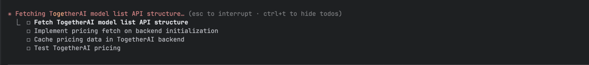

### Issues

#### Add messages midflight

#### Error Log

Add error logs file, have option in hoosh to examine those logs

#### First Ctrl+C

should always cancel current operation instead of exiting the program, with second Ctrl+C exiting

#### Circuit breaker

for LLM calls when repeated failures occur

#### Memory-> and the tool to load

I find myself referencing previous conversations often, so having a way to load previous conversations into memory would
be helpful. Maybe a command like /load_conversation <conversation_id> that fetches and loads the conversation into the
current context.

#### Status Flaky

after approval rejection status line stucks on processing

#### Large Diffs

currently when there are large diffs in files, the entire file is shown in the diff view. It would be better to
only show the relevant changes with some context lines around them, similar to how git shows diffs

#### Running Todos

currently there are no running todos like in claude code, this can create a better ux and system prompting for the model
CRUDing todos could also be a tool call for the model
